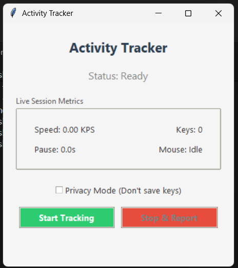
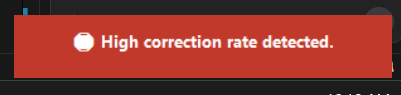
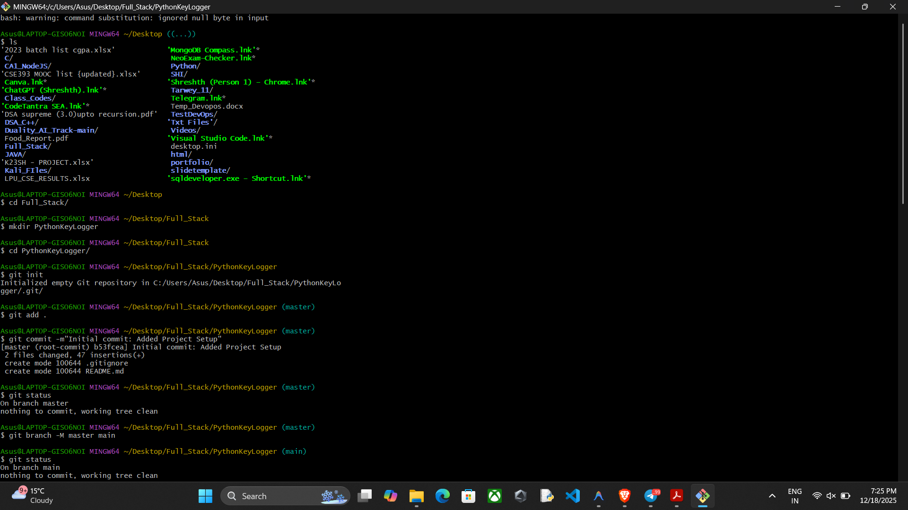
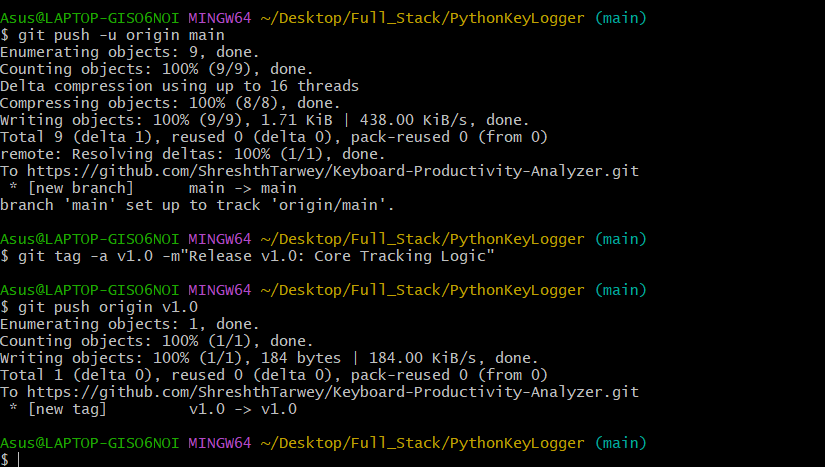
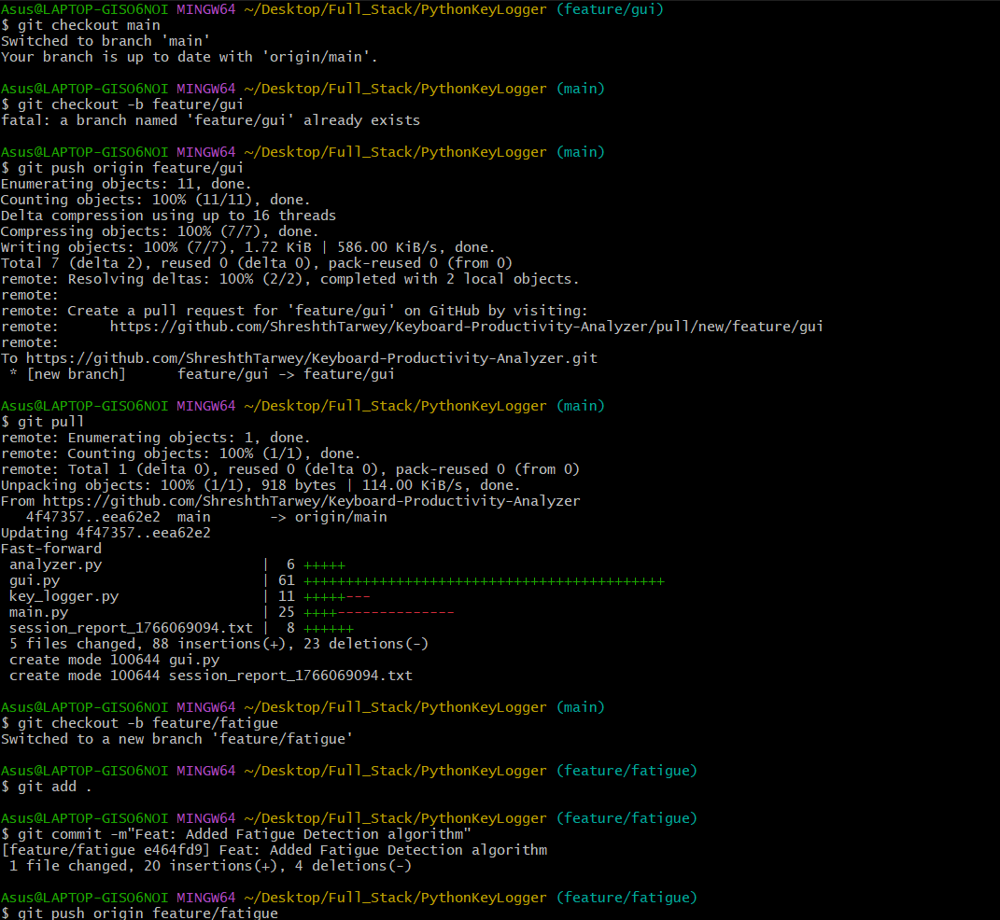
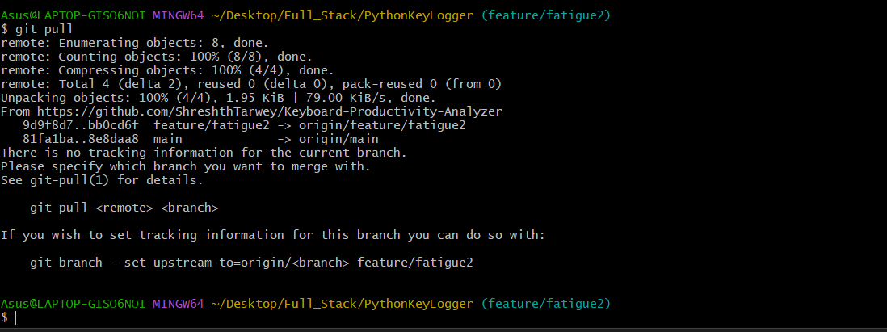
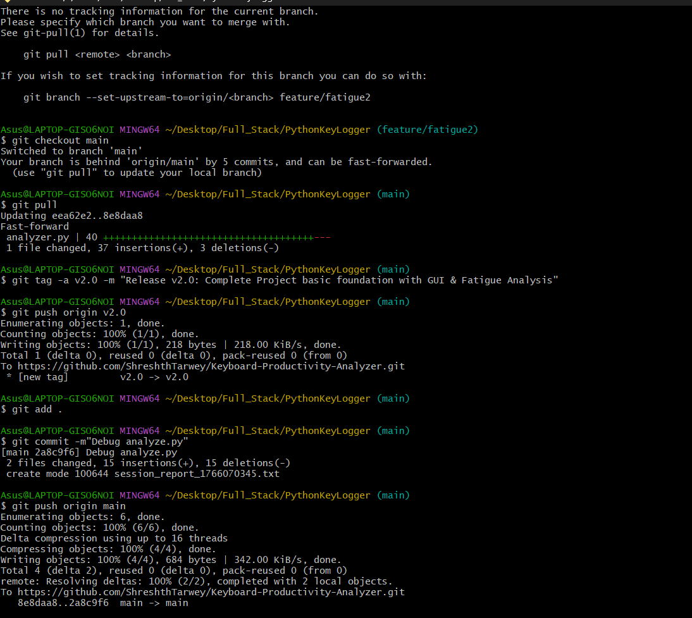
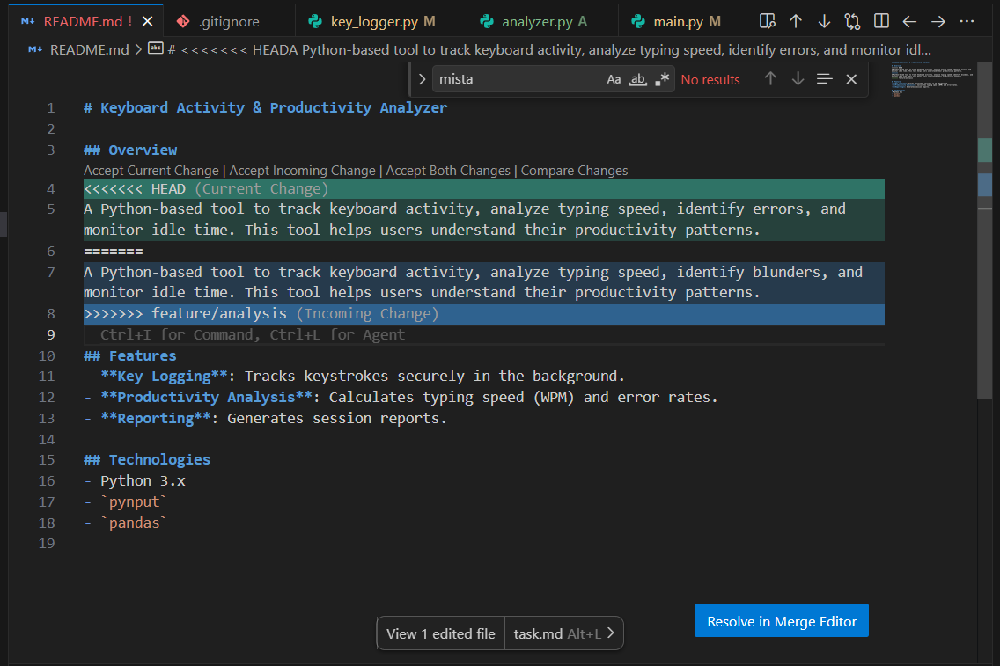
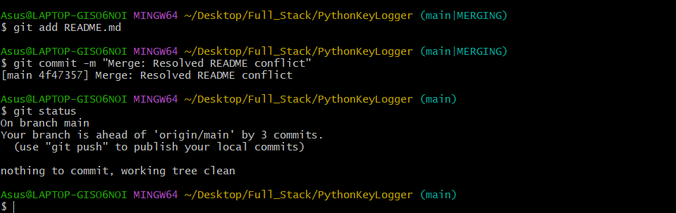
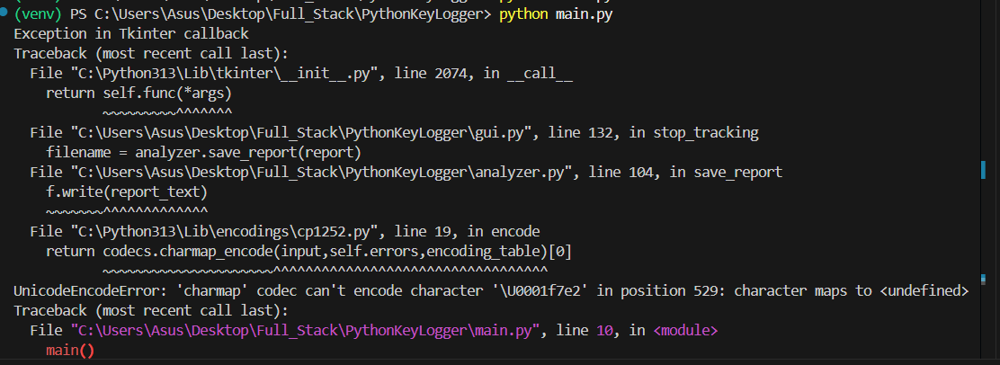

# 📊 Keyboard Activity & Productivity Analyzer (v3.0)

## 1. Introduction
The **Keyboard Activity & Productivity Analyzer** is an advanced Python application designed to track user typing behavior, analyze productivity trends, and detect fatigue in real-time. Unlike simple keyloggers, this tool focuses on **work habits**, offering detailed insights into typing speed, error rates, and focus levels while prioritizing user privacy. It features a modern GUI, PDF reporting, and intelligent alerts.

---

## 2. Detailed Features & Logic
This section explains the technical implementation and rules behind every feature.

### 🔹 Feature 1: Real-Time Metrics
The application tracks your activity millisecond-by-millisecond to provide live feedback.
*   **Speed (KPS)**: Calculated as `Total Keys / Duration`. output in Keys Per Second.
*   **Pause Duration**: Tracks the time elapsed since the last key press or mouse movement.
*   **Mouse Status**: Detects if the mouse is "Active" (<1s since move) or "Idle".

### 🔹 Feature 2: Mistake Analysis (Error Rate)
We track the quality of your work by monitoring corrections.
*   **Logic**: Every time the `Backspace` key is pressed, it is counted as a correction.
*   **Correction Ratio**: `(Total Backspaces / Total Keystrokes) * 100`.
*   **Insight**: A high ratio (>15%) usually indicates multitasking or lack of focus.

### 🔹 Feature 3: Advanced Fatigue Scoring (The Algorithm)
We implemented a custom algorithm to quantify "Energy Levels" on a scale of 0-100.
**The Formula:**
```python
Score = 100 - (Idle Penalty) - (Sluggishness Penalty) - (Error Penalty)
```

**The Rules:**
1.  **Deep Idle Penalty**: If a pause lasts **> 10 seconds** (Demo Threshold), subtract **20 points**. This indicates "zoning out".
2.  **Minor Distraction**: If a pause lasts **> 5 seconds**, subtract **5 points**.
3.  **Sluggishness**: If the average time a key is held down exceeds **150ms** (0.15s), subtract **10 points**. Tired users press keys slower.
4.  **Error Penalty**: Subtract `Correction Ratio * 2`. Unfocused users make more mistakes.

**Status Labels:**
*   **90-100**: 🟢 Energetic / Flow State
*   **60-89**: 🟡 Normal
*   **0-59**: 🔴 Fatigued (Need a Break)

### 🔹 Feature 4: Smart Alerts (Toast Notifications) 🧠
The app uses real-time pattern matching to trigger "Toast" notifications (Windows-style popups) without using expensive AI models.

**Trigger Rules:**
*   **Fatigue Alert**: Triggered if the user takes **3 Long Pauses (>15s)** within a 1-minute window.
    *   *Message*: "⚠️ You seem tired. Consider a break."
*   **Error Burst Alert**: Triggered if **5 Backspaces** are detected within **5 seconds**.
    *   *Message*: "🛑 High correction rate detected."

### 🔹 Feature 5: Privacy Mode 🔒
Designed for public environments or sensitive work.
*   **How it works**: When "Privacy Mode" is enabled via the Checkbox, the logger **stops recording actual characters**.
*   **Data Saved**: Instead of saving `'a'`, `'b'`, `'c'`, it saves `'HIDDEN'`, `'HIDDEN'`, `'HIDDEN'`.
*   **Benefit**: You get all the stats (Speed, Pauses, Fatigue) without risking password or message leaks.

### 🔹 Feature 6: Visual Reporting (PDF & Graphs)
Instead of plain text, the app generates a professional PDF report.
*   **Graph Generation**: Uses `matplotlib` to create a "Work Intensity" histogram, bucketed by seconds.
*   **PDF Assembly**: Uses `reportlab` to combine the text statistics and the generated graph into a single file in the `reports/` folder.

### 🔹 Feature 7: Session History & Comparison
data is persisted in `data/history.csv` to track long-term trends.
*   **Comparison Logic**: The app reads the *previous* session's Speed and Score.
*   **Trend Analysis**:
    *   🟢 **Improved**: Score is higher than last time.
    *   🔴 **Worsened**: Score is lower.
    *   🟡 **Stable**: Score is identical.

---

## 3. Git Commands & Workflow 🛠️
We followed a strict "Feature Branch Workflow" to ensure code quality. Here is every Git command used in this project:

### **Setup & Basics**
*   `git init`: Initialized the empty repository to start tracking changes.
*   `git add .`: Staged all modified files (moved them to the "holding area") before committing.
*   `git commit -m "message"`: Saved a snapshot of the staged changes with a descriptive message.
*   `git status`: Checked which files offered, modified, or staged. Used constantly.
*   `git log`: Viewed the history of commits to verify progress.

### **Branching & Merging**
*   `git branch`: Listed all local branches to see where we were.
*   `git branch feature/xyz`: Created a new isolated branch for a specific feature.
*   `git checkout feature/xyz`: Switched focus to that branch.
*   `git checkout -b feature/xyz`: **(Pro Tip)** Created and switched to a branch in one command.
*   `git checkout main`: Switched back to the main codebase.
*   `git merge feature/xyz`: Integrated the completed feature into the main branch.

### **Remote & GitHub**
*   `git remote add origin <url>`: Linked our local folder to the GitHub repository.
*   `git push -u origin main`: Uploaded the code to GitHub for the first time.
*   `git search` / `git pull origin main`: Downloaded the latest changes from GitHub (crucial before starting new features).

### **Advanced Operations**
*   `git tag v1.0`: Marked specific points in history as releases (Version 1.0, 2.0).
*   `git push --tags`: Uploaded these release tags to GitHub.

---

## 4. Installation & Usage

1. **Create a Virtual Environment**:
    ```bash
    python -m venv venv
    ```

2. **Activate the Virtual Environment**:

    2.1 Windows
    ```bash
    venv\Scripts\activate
    ```
    2.2 Linux/macOS
    ```bash
    source venv/bin/activate
    ```

1.  **Install Dependencies**:
    ```bash
    pip install -r requirements.txt
    ```
    *Dependencies: `pynput` (Input), `pandas` (Data), `matplotlib` (Graphs), `reportlab` (PDF), `tk` (GUI).*

2.  **Run the Application**:
    ```bash
    python main.py
    ```

---

## 5. Screenshots

### 5.1 Project Screenshots
**Main Dashboard (GUI)**


**PDF Report with Graph**


**Smart Alert (Popup)**


### 5.2 Git Bash Screenshots

#### Git Basic Command


#### Git Status Command


#### Git Merge and Push Command


#### Git Pull Command


#### Git Tag Command


---

---

## 6. Challenges & Solutions

### Challenge 1: Git Merge Conflicts
**The Problem**: During development, we worked on the `feature/metrics` branch and `main` simultaneously. Both branches modified line 10 of `analyzer.py`. When merging, Git flagged a conflict.


*(Conflict detected in VS Code)*

**The Solution**: We opened VS Code, used the "Compare Changes" view, and manually selected the "Incoming Change" that contained the superior logic, then committed the resolution.



### Challenge 2: Windows Encoding Errors
**The Problem**: The application crashed when saving reports containing emojis (🟢, 🔴) on Windows, raising a `UnicodeEncodeError`.



**The Solution**: We modified the file write operation in `src/analyzer.py` to explicitly use `encoding='utf-8'` instead of the system default (cp1252), allowing full emoji support.
**The Problem**: The application crashed when saving reports containing emojis (🟢, 🔴) on Windows, raising a `UnicodeEncodeError`.
**The Solution**: We modified the file write operation in `src/analyzer.py` to explicitly use `encoding='utf-8'` instead of the system default (cp1252), allowing full emoji support.

### Challenge 3: Live Graphing Performance
**The Problem**: Generating a graph in real-time caused the GUI to freeze.
**The Solution**: We shifted graph generation to the *end* of the session (Post-Processing) and optimized it to bucket data into 1-second intervals, ensuring the UI remains buttery smooth.

---


## 7. 📁 Directory Structure

```text
Keyboard-Productivity-Analyzer/
├── src/
│   ├── analyzer.py          # Fatigue & productivity logic
│   ├── key_logger.py        # Keyboard data collection
│   ├── gui.py               # Tkinter GUI
│   └── init.py
├── data/
│   └── history.csv          # Session history storage
├── reports/
│   └── session_report_*.pdf # Auto-generated reports
├── screenshots/
│   ├── GUISS1.png
│   ├── ReportScreenshot.png
│   ├── Alert.png
│   ├── SS1.png - SS5.png
│   ├── MergeConflict_Local.png
│   ├── MergeConflictResolved.png
│   └── Encoding_Error.png
├── main.py                  # Application entry point
├── requirements.txt         # Project dependencies
├── README.md                # Project documentation
└── .gitignore               # Git ignored files 
```


## 8. Conclusion
This project successfully transformed a simple CLI keylogger into a full-featured productivity suite. By implementing a custom **Fatigue Algorithm** and **Smart Alerts**, the tool provides actionable value to users. The modular architecture (`src/` vs `reports/`) ensures the code is maintainable and scalable for future AI integrations.
